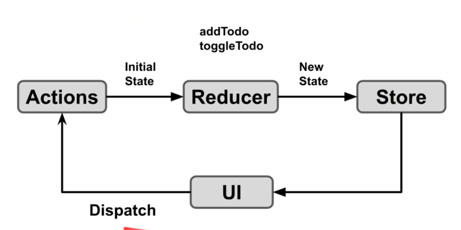

## Testing for JavaScript
- Jest documentation: https://jestjs.io/docs/setup-teardown
- Enzymn documentation: https://enzymejs.github.io/enzyme/docs/api/
- learning source: https://www.udemy.com/course/testing-react-and-redux-applications-unit-and-integration

## Redux Recap

- In React, UI built from React Components which then get rendered into DOM.
- From UI, users take actions and dispatch actions then triggers reducers.

### Reducers
- reducers are simple functions that take 2 things as argument, initial state & type of action
- initial state - what the current state of our application
- type of action - the action we want to invoke that reducer with
- the job of the reducer is to produce a new state which then updates our store which then updates our UI based on the changes

## Jest
### Setup and Tear Down
- beforeEach() - put things you want to initially set up before your test executes
- afterEach() - put things in there that you want to clean up, like clean up the database

## Enzymn
### Shallow Rendering
- basic component
- no children components

### Full Rendering
- need js dom since it involves dom

